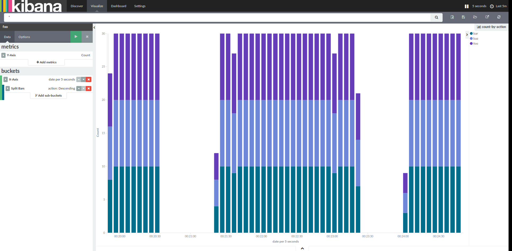

Usage
=====
Run things via docker compose and get a URL to NiFi::

    make

Now generate some data::

    make produce

Have fun with NiFi.

Next, navigate to `Kibana`_

.. _Kibana: http://localhost:5601/app/kibana#/visualize/edit/count-by-action?_g=(refreshInterval:(display:%275%20seconds%27,pause:!f,section:1,value:5000),time:(from:now-5m,mode:relative,to:now))&_a=(filters:!(),linked:!f,query:(query_string:(analyze_wildcard:!t,query:%27*%27)),uiState:(),vis:(aggs:!((id:%271%27,params:(),schema:metric,type:count),(id:%272%27,params:(customInterval:%272h%27,extended_bounds:(),field:date,interval:auto,min_doc_count:1),schema:segment,type:date_histogram),(id:%273%27,params:(field:action,order:desc,orderBy:%271%27,size:5),schema:group,type:terms)),listeners:(),params:(addLegend:!t,addTimeMarker:!f,addTooltip:!t,defaultYExtents:!f,mode:stacked,scale:linear,setYExtents:!f,shareYAxis:!t,times:!(),yAxis:()),title:count-by-action,type:histogram))

Pictures!
=========

Notes
=====
- ``./consume.py`` may take a while to initialize (TODO: find out why)
